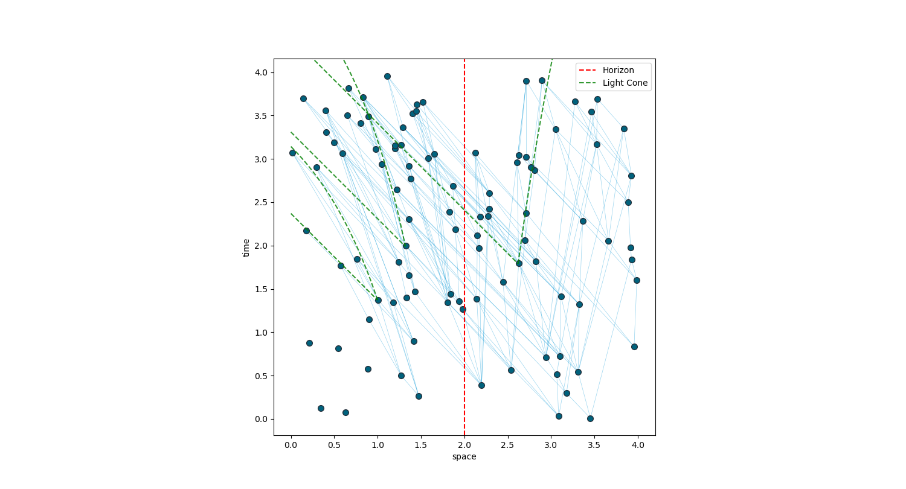
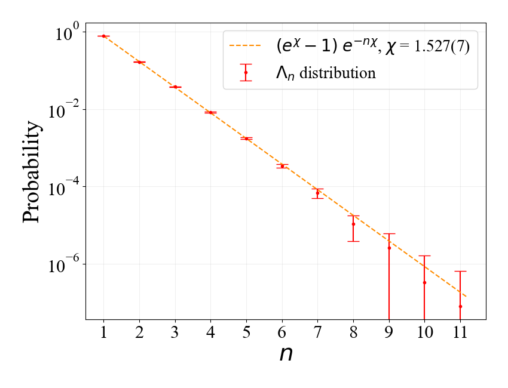

# FRAMEWORK FOR CAUSET CODING

## Introduction

Causal set theory is an approach to quantum gravity where a spacetime continuous manifold is replaced by a discrete locally finite, partially ordered sets i.e., causal sets or, in short, causets. This repository contains C++ modules for numerical investigations of causal set theory, and a python module for plotting.

The possible representations of the causets here implemented are:

- causal matrices C, such C_ij = 1 iff i preceeds j.
- past/future sets S, such that S[i] contains j iff i follows/preceeds j.
- past/future link sets LS, such that LS[i] contains j iff 'j prec i / i prec j' is a link.  

Causets can be embedded in a region of spacetime. The code currently supports:

- shapes: cube, cuboid, cylinder, ball, bicone(diamond).
- spacetimes: Minkowski/Flat, Schwarzschild/BlackHole. The latter can use the following coordinates: Schwarzschild, EF-v, EF-t*.

## The modules

Generic purpose C++ and python files can be found in src folder.

The C++ modules(classes) in src/cpp (but also in their prior version in scripts_cpp/causets_cpp):

- causet.cpp(Causet): handles a generic causet, NOT embedded in a spacetime, i.e. the points do not have coordinates assigned.
- embeddedcauset.cpp(EmbeddedCauset): it inherits from Causet to handle a causet embedded in a region of spacetime.
- sprinkledcauset.cpp(SprinkledCauset): it inherits from EmbeddedCauset to generate via Poisson Sprinkling a causet embedded in a given region of spacetime.
- shapes.cpp(Shape): it handles the definition of the aforementioned implemented shapes*. 
- spacetime.cpp(Spacetime): it handles the definition and properties of a the spacetime metrics*.


*some methods in the shapes and spacetime classes have been inspired by Cristoph Minz's work, whose code can be found at [https://github.com/c-minz/Python-causets](https://github.com/c-minz/Python-causets) and for which we cite "C. J. Fewster, E. Hawkins, C. Minz, and K. Rejzner, Local structure of sprinkled causal sets, Phys. Rev. D 103, 086020 (2021)" ([https://doi.org/10.1103/PhysRevD.103.086020](https://doi.org/10.1103/PhysRevD.103.086020)). Also the inheritance structure Causet>EmbeddedCauset>SprinkledCuaset was inspired by his work.

The python modules in src/pythin (but also in their prior version in scripts_py/causets_py):

- causetplotting.py: functions for the plotting of a causet from a file saved in the format determined by the EmbeddedCauset::save_causet(). Methods associate to this purpose were mostly written by Cristoph Minz, whose code can be found at [https://github.com/c-minz/Python-causets](https://github.com/c-minz/Python-causets). As this coding framework was born for horizon molecules' analysis, the EmbeddedCauset::save_molecules() function saves information about both causets and molecules, and python functions make it is also possible to plot certain type of horizon molecules. It uses 'matplotlib'. 
- causethelpers.py: some functions in support of the plotting.
- relfunctions.py: some functions concerning general relativity, using SymPy library for symbolic computations.

The modules (classes and functions) are extensively documented.

## Requirements

The C++ boost library is required for integration and equation solving. We used boost_1_80_0, which should be available at this link here [https://www.boost.org/users/history/version_1_80_0.html](https://www.boost.org/users/history/version_1_80_0.html) The boost/numeric/odeint/integrate/integrate.hpp file was modified, adding the following at line 59:

```c++
//I PUT THIS
template<class System , class State , class Time , class Observer >
size_t 
integrate( System system , State &start_state , Time start_time , Time end_time , Time dt , Observer observer )
{
    typedef controlled_runge_kutta< runge_kutta_dopri5< State , State , State , Time > > stepper_type;
    return integrate_adaptive( stepper_type() , system , start_state , start_time , end_time , dt , observer );
}
```

Also, if you lack the mutex C++ module, which is possible on Windows, it is advisable to comment out lines 409-412 in boost/math/special_functions/detail/polygamma.hpp.

Finally, plotting in Python makes use of scipy, numpy and matploltib.pyplot.

## Testing

Most of the implemented code has been tested. The test files are in scripts_cpp/tests and scripts_py. Their name contains the string 'test'. It is specified whether functions have been tested.

## Example Results

The following is a plot of a 100-events Causet embedded in a cubic region of a 2D Schwarzschild spacetime, in EF-t^* coordinates. Light cones on the manifold of three points are also explicitly shown.


Then, the main results of our work: the distribution of n-lambda molecules across the horizon of a 3+1D Schwarzschild black hole. We studied up to 1.011-milion-elements causets and we saw the number of lambdas scales proportional with area, and the distribution of the n-lambdas follows an exponential fall (like thermodynamic molecules).




## Use and License

If you wish to contribute to the project, please get in contact via email:
<stefano.veroni19@imperial.ac.uk>,
<vid.homsak19@imperial.ac.uk>

If you use the code for your project, please cite:
"Homsak V, Veroni S. Framework for Causet Coding. 2022."

The source code is published under the BSD 3-Clause License, see [license file](LICENSE.md).
Copyright (c) 2020-2022, Stefano Veroni, Vid Homsak
